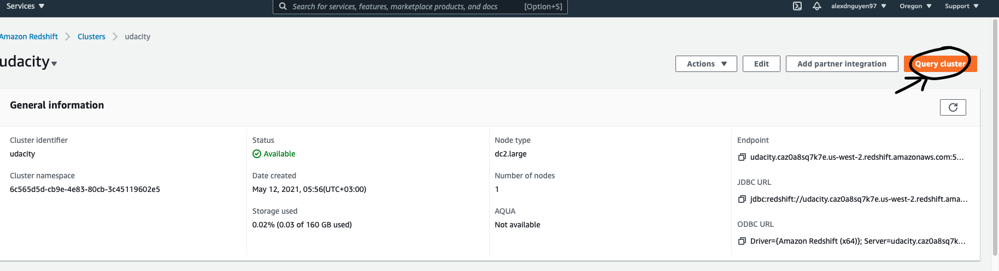
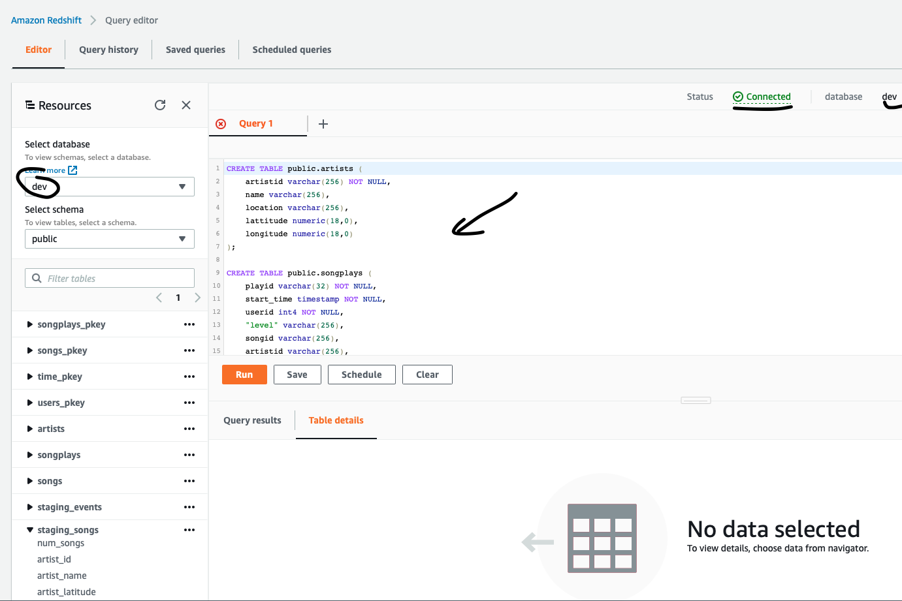

# Data pipelines with Airflow

## 1. Introduction
Creating high grade data pipelines that are dynamic and built from reusable tasks, can be monitored, and allow easy backfills. They have also noted that the data quality plays a big part when analyses are executed on top the data warehouse and want to run tests against their datasets after the ETL steps have been executed to catch any discrepancies in the datasets.

The source data resides in S3 and needs to be processed in Sparkify's data warehouse in Amazon Redshift. The source datasets consist of JSON logs that tell about user activity in the application and JSON metadata about the songs the users listen to.

To complete the project, you will need to create your own custom operators to perform tasks such as staging the data, filling the data warehouse, and running checks on the data as the final step.

Here is the DAG:

## 2. Dataset and DAG configuration
<li>Log data: s3://udacity-dend/log_data</li>
<li>Song data: s3://udacity-dend/song_data</li>

### Configuring the DAG
In the DAG, add default parameters according to these guidelines

- The DAG does not have dependencies on past runs
- On failure, the task are retried 3 times
- Retries happen every 5 minutes
- Catchup is turned off
- Do not email on retry

## 3. Create tables on Redshift
#### Use the query editor

Sign in to the AWS Management Console and open the Amazon Redshift console at https://console.aws.amazon.com/redshift/.

On the navigation menu, choose *EDITOR*, then connect to a database in your cluster.

On the Connect to database page, there are two ways to authenticate, namely, Temporary credentials and Secrets Manager. For this tutorial, choose Create a new connection and Temporary credentials, then enter the values that you used when you created the cluster, as follows:

Cluster: Choose examplecluster.

**Database name**: Enter *dev*.

**Database user**: Enter *awsuser*.

Then choose *Connect*.

For *Schema*, choose *public*.

Enter the following in the query editor window, and choose Run to create a new table.

## 4. Implementation
### Stage Operator
The stage operator is expected to be able to load any JSON formatted files from S3 to Amazon Redshift. The operator creates and runs a SQL COPY statement based on the parameters provided. The operator's parameters should specify where in S3 the file is loaded and what is the target table.

The parameters should be used to distinguish between JSON file. Another important requirement of the stage operator is containing a templated field that allows it to load timestamped files from S3 based on the execution time and run backfills.

### Fact and Dimension Operators
With dimension and fact operators, you can utilize the provided SQL helper class to run data transformations. Most of the logic is within the SQL transformations and the operator is expected to take as input a SQL statement and target database on which to run the query against. You can also define a target table that will contain the results of the transformation.

Dimension loads are often done with the truncate-insert pattern where the target table is emptied before the load. Thus, you could also have a parameter that allows switching between insert modes when loading dimensions. Fact tables are usually so massive that they should only allow append type functionality.

### Data Quality Operator
The final operator to create is the data quality operator, which is used to run checks on the data itself. The operator's main functionality is to receive one or more SQL based test cases along with the expected results and execute the tests. For each the test, the test result and expected result needs to be checked and if there is no match, the operator should raise an exception and the task should retry and fail eventually.

For example one test could be a SQL statement that checks if certain column contains NULL values by counting all the rows that have NULL in the column. We do not want to have any NULLs so expected result would be 0 and the test would compare the SQL statement's outcome to the expected result.

**Note about Workspace**
After you have updated the DAG, you will need to run `/opt/airflow/start.sh` command to start the Airflow web server. Once the Airflow web server is ready, you can access the Airflow UI.
## 5. Result
